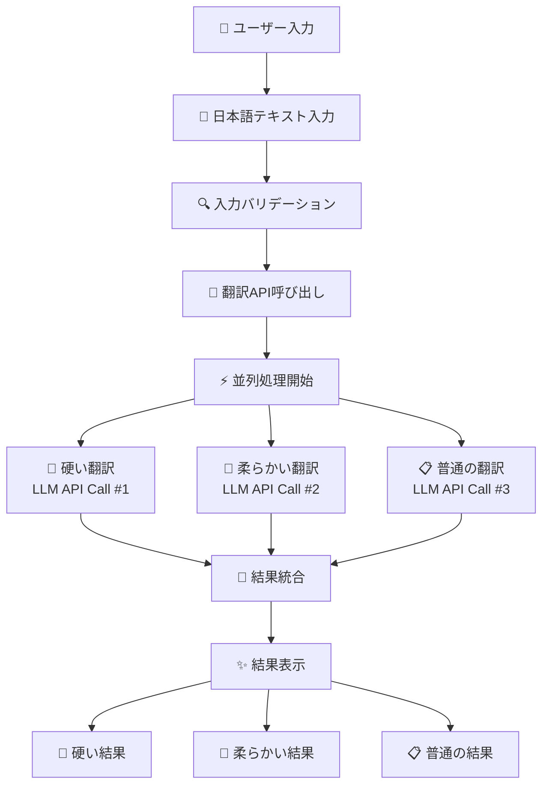

# 📋 翻訳アプリ要件定義書

**要望 ID**: REQ-TRANSLATE-001  
**作成日**: 2025-01-28  
**プロジェクト**: 日本語翻訳アプリ（硬い・柔らかい・普通の 3 段階翻訳）

---

## 📊 エグゼクティブサマリー

本要件定義書は、日本語テキストを LLM で 3 つのトーン（硬い・柔らかい・普通）で英語翻訳する Web アプリケーションの開発要件をまとめたものです。個人利用を前提としたローカル環境での動作を想定し、Next.js + shadcn/ui + LLM API の技術スタックを採用することで、高品質な UI/UX と効率的な開発を実現します。

---

## 🎯 選択された技術スタックの詳細

### **技術スタック選択結果**: (2) AI や API のみを使うアプリケーション（カスタマイズ版）

**推奨技術スタック:**

- **フロントエンド**: Next.js + TypeScript + shadcn/ui
- **バックエンド**: Next.js API Routes（LLM API 連携）
- **LLM API**: OpenAI API / Claude API
- **データベース**: 不要（ローカルストレージのみ）
- **ホスティング**: Vercel（または localhost）
- **認証**: 不要
- **CSS**: Tailwind CSS（shadcn/ui 標準）

**選択理由:**

- LLM 処理が中心機能で要件に最適
- shadcn/ui による美しい UI（ユーザー要望）
- 将来の多言語対応に柔軟
- ローカル個人利用に適したシンプル構成

---

## ✅ 要件ジャッジ結果

- **実施判定**: **Yes** ✅
- **優先度**: **高**
- **技術スタック適合性**: **最適** ⚡
- **影響範囲**: 新規アプリケーション作成（既存への影響なし）

**判断理由:**

1. **技術的実現性**: 高 - LLM API との連携は確立技術
2. **開発効率**: 高 - シンプルな要件、認証・DB 不要
3. **拡張性**: 中〜高 - 多言語対応への発展可能

---

## 📁 変更対象ファイル・関数リスト

### 新規作成ファイル・ディレクトリ

```
translation-app/
├── 📁 components/
│   ├── ui/                    # shadcn/ui コンポーネント
│   ├── TranslationForm.tsx    # 翻訳入力フォーム
│   ├── TranslationResults.tsx # 翻訳結果表示
│   └── LoadingSpinner.tsx     # ローディング表示
├── 📁 pages/
│   ├── api/
│   │   └── translate.ts       # LLM API連携エンドポイント
│   ├── _app.tsx              # Next.js アプリ設定
│   ├── _document.tsx         # HTML ドキュメント設定
│   └── index.tsx             # メインページ
├── 📁 lib/
│   ├── utils.ts              # ユーティリティ関数
│   └── prompts.ts            # LLM プロンプト定義
├── 📁 styles/
│   └── globals.css           # グローバルスタイル
├── 📄 package.json           # 依存関係定義
├── 📄 next.config.js         # Next.js 設定
├── 📄 tailwind.config.js     # Tailwind CSS 設定
├── 📄 components.json        # shadcn/ui 設定
└── 📄 .env.local            # 環境変数（APIキー）
```

### 主要関数・メソッド

#### `pages/index.tsx`

- `HomePage()` - メインコンポーネント
- `handleTranslationSubmit()` - 翻訳実行処理

#### `pages/api/translate.ts`

- `handler()` - API Route ハンドラー
- `callLLMAPI()` - LLM API 呼び出し
- `generatePrompts()` - 3 段階プロンプト生成

#### `components/TranslationForm.tsx`

- `TranslationForm()` - フォームコンポーネント
- `handleInputChange()` - 入力変更処理
- `validateInput()` - 入力バリデーション

#### `components/TranslationResults.tsx`

- `TranslationResults()` - 結果表示コンポーネント
- `copyToClipboard()` - コピー機能
- `formatResults()` - 結果整形

---

## 💾 データ設計方針

### State 管理設計

```typescript
interface TranslationState {
  inputText: string; // 入力日本語テキスト
  isLoading: boolean; // ローディング状態
  results: {
    formal: string; // 硬い翻訳結果
    casual: string; // 柔らかい翻訳結果
    normal: string; // 普通の翻訳結果
  } | null;
  error: string | null; // エラーメッセージ
}
```

### データ管理方針

- **データベース**: 不要（要件通り）
- **データ永続化**: なし（履歴保存不要）
- **状態管理**: React State（Redux 不要）

---

## 🎨 画面設計方針

### UI/UX 設計

- **レイアウト**: シングルページ、3 カラム構成
- **レスポンシブ**: デスクトップ中心（モバイル不要）
- **コンポーネント**: shadcn/ui 使用
  - Input（テキスト入力）
  - Button（翻訳実行）
  - Card（結果表示）
  - Badge（翻訳タイプ識別）
  - Alert（エラー表示）

---

## 🔌 API 設計方針

### `POST /api/translate`

**リクエスト:**

```typescript
{
  text: string; // 翻訳対象テキスト
  apiProvider: "openai" | "claude"; // 使用API
}
```

**レスポンス:**

```typescript
{
  success: boolean;
  data?: {
    formal: string;    // 硬い翻訳
    casual: string;    // 柔らかい翻訳
    normal: string;    // 普通の翻訳
  };
  error?: string;
}
```

---

## 📊 処理フロー



---

## ⏱️ 開発工数見積

| タスク             | 見積時間 | 難易度 |
| ------------------ | -------- | ------ |
| 環境セットアップ   | 2 時間   | 低     |
| shadcn/ui 導入     | 1 時間   | 低     |
| 基本レイアウト     | 3 時間   | 中     |
| 翻訳フォーム       | 2 時間   | 低     |
| 結果表示 UI        | 3 時間   | 中     |
| API Route 実装     | 4 時間   | 中     |
| プロンプト調整     | 4 時間   | 高     |
| エラーハンドリング | 2 時間   | 中     |
| UX 改善            | 2 時間   | 低     |
| テスト・デバッグ   | 3 時間   | 中     |
| コード整理         | 2 時間   | 低     |

**⏱️ 総開発時間**: 28 時間  
**👨‍💻 総人日**: **3.5 人日**

---

## 🧪 テスト戦略

### 手動テスト中心（ローカル使用向け）

- **結合テスト**: API 動作確認（Postman/curl）
- **E2E テスト**: ブラウザでの実際操作確認
- **性能テスト**: 長文翻訳・同時処理確認

### テストケース

1. 正常系: 日本語入力 → 3 段階翻訳成功
2. 異常系: 空文字 → バリデーションエラー
3. 異常系: API 異常 → エラーメッセージ
4. 性能系: 長文翻訳 30 秒以内完了

---

## ⚠️ リスク分析と対策

### 高リスク

- **LLM API 制限・料金**: 使用量モニタリング
- **プロンプト品質**: 段階的改善・テスト

### 中リスク

- **Next.js 学習コスト**: ドキュメント活用
- **shadcn/ui 設定**: セットアップガイド

### 低リスク（ローカル使用で軽減）

- **セキュリティ**: 基本対策のみ
- **スケーラビリティ**: 個人使用で考慮不要

---

## 📋 未確定事項 & TODO

### 🔍 要確認事項

1. **【要確認】LLM API 選択**: OpenAI vs Claude
2. **【要確認】プロンプト詳細**: 翻訳品質期待レベル
3. **【要確認】UI/UX 詳細**: カラーテーマ・フォント

### ✅ 次のアクション

1. API キー取得
2. 開発環境構築
3. MVP 実装開始

---

## 🎯 技術スタック固有の注意点

### Next.js + shadcn/ui

- 初期セットアップの手順遵守
- コンポーネント設定の正確性
- Tailwind CSS 設定の整合性

### LLM API 連携

- 並列処理実装でのパフォーマンス最適化
- エラーハンドリングとタイムアウト設定
- プロンプトエンジニアリングの継続改善

### ローカル開発環境

- 環境変数管理（.env.local）
- 開発・本番ビルドの使い分け
- シンプルな運用フロー

---

最終更新: 2025-01-28 16:30:00 JST
