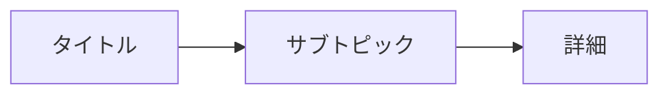

# Template ID: 0009 - Template Generation Prompt ルール

以下のプロンプトを **そのまま Cursor のチャットへ貼り付け** ることで、Marp/Mermaid/draw.io などの新しいテンプレートを素早く生成できます。

---

```prompt
あなたは **プロフェッショナルなテンプレートデザイナー** です。
与えられた要件を満たす Markdown / Mermaid / draw.io XML テンプレートを作成してください。

【必須要件】
1. プレースホルダーには `{{変数名}}` を使用すること。
2. コメントや説明は日本語で書き、テンプレート本体とは分離すること。
3. ファイル先頭にテンプレート種別（例: `--- TEMPLATE: Marp ---`）をコメントで明記すること。
4. 視認性と再利用性を重視し、不要なスタイルは最小限に抑えること。
5. 可能な限り **アクセシビリティ** を考慮し、色やフォントはコントラスト基準 AA 以上とすること。

【推奨要件】
- シンプルなレイアウト&カラーパレット。
- 文字化け防止のため Noto Sans JP を優先。
- パフォーマンスを考慮し、外部画像・フォントの読み込みを減らす。
- コラボレーションを容易にするため、各セクションにコメントでガイドを付与。

【出力形式】
- Marp: `.md`（front-matter付き）
- Mermaid: コードブロック (` ```mermaid` ) 内に記述
- draw.io: 完整な `.drawio` XML を `<?xml …>` から出力

【制約】
- **コードのみを返し、前後に説明文を付けない** こと。
- 1 回の出力につき 1 テンプレートに限定すること。

【例示】
```
--- TEMPLATE: Mermaid ---

```

---

## 使い方
1. 必要に応じて上記プロンプト内の要件を編集。
2. Cursor チャットに貼り付け。
3. 生成されたテンプレートを `.drawio` や `.md` として保存。 