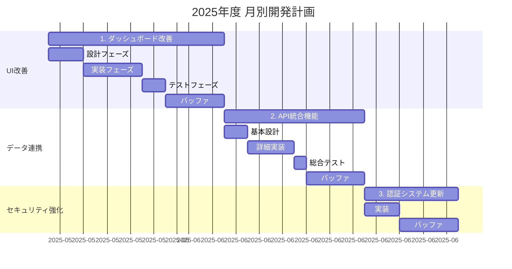

# Template ID: 0010 - Cursor × ガントチャート自動生成テンプレート

## 概要
詳細設計書からガントチャートを自動生成するためのプロンプトテンプレート集です。要件定義→タスク分解→スケジュール生成→レビューまでを一気通貫で実現します。

## フェーズ1: 要件収集と計画準備

### フロー1.1: 要件定義情報の抽出と整理

```text
# 指示: 要件定義情報の抽出と整理

以下の要件定義情報（または指定されたファイル）を分析し、各開発要件について下記の情報を抽出・整理して表形式でまとめてください。

抽出項目:
1.  NO. (ログで示された画像の順番に対応する番号、もし不明な場合は連番)
2.  要件名 (例: 「新機能A開発」「既存機能B改善」のように、具体的なサービス名や内部用語を避け、一般的な名称で記載してください)
3.  カテゴリ (例: UI改善, データ連携, セキュリティ強化, 新規機能 など、機能の分類。要件定義情報から読み取れる場合、または推測できる場合は記載してください。不明な場合は空欄でも可)
4.  優先度 (例: 高, 中, 低。要件定義情報から読み取れる場合)
5.  想定工数(人日) (バッファを含まない純粋な開発工数)
6.  段階的アップデートフロー (もしあれば、各フェーズ名と各フェーズの想定工数(人日)を記載。例: 「フェーズ1: 基本設計(X日), フェーズ2: 詳細実装(Y日), フェーズ3: 総合テスト(Z日)」)
7.  概要 (任意、参考情報として、機能の目的や主要な変更点を簡潔に記載)

対象となる要件定義情報:
---
[ここに要件定義ファイルの内容を貼り付けるか、ファイルパスを指定してください。複数のファイルがある場合は、それぞれ分けて記載または指定してください。]
---

抽出結果は、後の開発計画作成に使用します。
```

### フロー1.2: 実装順序決定方針のヒアリング

```text
# 実装順序の決定方針について

開発計画における各要件の実装順序を決定するための方針を選択してください。
以下のいずれかの方針を選び、次のステップ（フロー1.3）でCursorエージェントに指示を出す際に、該当する指示内容を有効にしてください。

【選択肢】
1.  **指定の一覧がある:**
    あらかじめ決定された実装順序のリストに従います。

2.  **指定はないが優先度順に:**
    各要件に設定された「優先度」（高→中→低）の順で実装します。

3.  **「カテゴリ」ごとでまとめて対応、どのカテゴリを優先するかは、「優先度が高い」機能が多い順に:**
    要件を機能カテゴリごとにまとめ、カテゴリ内の「高」優先度案件の数が多いカテゴリから順に実装します。カテゴリ内の案件は優先度順に実装します。

4.  **「カテゴリごと」「工数配慮」「優先度」を加味してAIに提案させる:**
    カテゴリ、工数、優先度などの情報を総合的に考慮し、AIに最適な実装順序を提案させます。

ご希望の方針を決定してください。
```

### フロー1.3: 開発計画（タスクリスト）の作成

```text
# 指示: 月別開発計画（タスクリスト）の作成

フロー1.1で抽出・整理された要件情報（以下の表、または前ステップの出力結果を参照）と下記の条件に基づいて、2025年度の月別開発計画を表形式で作成してください。

[フロー1.1で作成された要件情報テーブルをここに貼り付けるか、参照を指示。このテーブルには「カテゴリ」「優先度」列が含まれていることを想定しています。]

開発計画の条件:
1.  **実装順序の決定:**
    /* ★★★★★ 以下のいずれかの方針を選択し、該当する指示ブロックのコメントを解除して有効にしてください。他の指示ブロックはコメントアウトまたは削除してください。 ★★★★★ */

    /* === 方針1: 指定の一覧がある === */
    /*
    以下のリストの順番で実装計画を立ててください:
    1.  [指定された要件名1] (NO.X相当)
    2.  [指定された要件名2] (NO.Y相当)
    3.  ... (以下続く)
    */

    /* === 方針2: 指定はないが優先度順に === */
    /*
    フロー1.1で抽出した要件情報の「優先度」に基づいて実装順序を決定してください。「高」を最優先とし、「中」、「低」の順とします。同じ優先度の要件が複数ある場合は、フロー1.1でリストアップされた順番（NO.順など）に従ってください。
    */

    /* === 方針3: 「カテゴリ」ごとでまとめて対応、どのカテゴリを優先するかは、「優先度が高い」機能が多い順に === */
    /*
    以下の手順で実装順序を決定してください:
    1.  要件を「カテゴリ」ごとにグループ化します。（カテゴリが空欄の要件は「その他」カテゴリとして扱ってください）
    2.  各カテゴリ内で「優先度が高い（例：高）」案件の数をカウントします。
    3.  「優先度が高い」案件の数が多いカテゴリから順に実装します。
        *   もし「優先度が高い」案件の数が同じカテゴリが複数ある場合は、次に「優先度が中くらい（例：中）」の案件が多い順、それでも同じ場合は「優先度が低い（例：低）」の案件が多い順とします。
        *   それでも順位が決まらない場合は、カテゴリ名のアルファベット順（またはNO.の若いものが含まれるカテゴリ順など、明確なルールを指定してください。例: フロー1.1のNO.順で最初に現れるカテゴリを優先）とします。
    4.  各カテゴリ内では、案件を「優先度」（高→中→低）の順に実装します。同じ優先度の案件が複数ある場合は、フロー1.1でリストアップされた順番（NO.順など）に従ってください。
    */

    /* === 方針4: 「カテゴリごと」「工数配慮」「優先度」を加味してAIに提案させる === */
    /*
    フロー1.1で抽出された要件情報（カテゴリ、工数、優先度など）を総合的に考慮し、最も効率的かつ効果的と考えられる実装順序を提案してください。
    提案の際には、以下の点を考慮してください（必要に応じて調整・追加してください）:
    *   カテゴリごとの関連性を考慮し、可能な限り同じカテゴリのタスクを連続させる。
    *   各四半期/月の工数負荷が平準化されるように配慮する（特定の時期に高負荷が集中しすぎないように）。
    *   優先度の高い案件は早期に着手することを基本とする。
    *   依存関係があるタスクがあれば考慮する（ただし、現時点では依存関係情報は提供されていません）。
    提案された実装順序とその理由を簡潔に説明してください。この提案に基づき、タスクリストを作成してください。
    */

    /* デフォルトとして、「方針2: 指定はないが優先度順に」を有効にしています。変更する場合は、上記コメントを編集してください。 */
    フロー1.1で抽出した要件情報の「優先度」に基づいて実装順序を決定してください。「高」を最優先とし、「中」、「低」の順とします。同じ優先度の要件が複数ある場合は、フロー1.1でリストアップされた順番（NO.順など）に従ってください。

2.  **スケジュールの開始日:** 2025年5月20日 (火曜日と仮定。営業日ベースで計算してください)
3.  **作業バッファ:** 各開発案件ごとに、タスク期間の最後に5日間の作業バッファを追加してください。
4.  **工数計算とスケジュール:**
    *   **工数が5人日を超える要件:**
        *   フロー1.1で抽出した「段階的アップデートフロー」がある場合、段階的アップデートフローでのスケジュール反映をしてください。
        *   「段階的アップデートフロー」がない場合は、フロー1.1で抽出した「想定工数」をスケジュール反映してください。
        *   上記で計算した合計工数の0.5倍をバッファとして加えたものがその要件の総期間となります。
    *   **工数が5人日以下の要件:**
        *   フロー1.1で抽出した「想定工数」をそのまま使用し、バッファ5日を加えたものがその要件の総期間となります。
5.  **出力表の列:**
    *   NO. (決定された実装順序に対応する連番)
    *   要件名 (一般的な名称で)
    *   カテゴリ (フロー1.1で抽出したカテゴリ)
    *   優先度 (参考情報として表示)
    *   開始日 (YYYY/MM/DD形式)
    *   終了日 (YYYY/MM/DD形式、バッファ期間を含む最終日)
    *   実工数(人日) (バッファを除く工数)
    *   バッファ(人日) (実工数の0.5倍)
    *   総工数(人日) (実工数 + バッファ)
    *   実装フェーズ詳細 (段階的アップデートフローを適用した場合は、0.8倍後の各フェーズ名と調整後工数を記載。例: 「フェーズ1: XX (A日), フェーズ2: YY (B日)」等。それ以外の場合はタスク概要を記載。)

作成された開発計画表は、次のガントチャート生成ステップで使用します。
```

## フェーズ2: ガントチャート生成

### フロー2.1: Mermaid用ガントチャートコードの生成

```text
# 指示: Mermaid用ガントチャートコードの生成

フロー1.3で作成した以下の月別開発計画表（または前ステップの出力結果）に基づいて、Mermaid形式のガントチャートを生成してください。

[フロー1.3で作成された開発計画表をここに貼り付ける]

Mermaidガントチャートの仕様:
1.  dateFormat YYYY-MM-DD を使用してください。
2.  title 20xx年度 月別開発計画 を設定してください。
3.  axisFormat %Y-%m (または表示期間に応じて %m-%d など適切なもの) を使用してください。
4.  各タスク名は「NO. 要件名」の形式で記載してください (例: 1. スケジュール連携機能)。
5.  タスクIDは task[NO.] のようにしてください (例: task1, task2)。
6.  各タスクの開始日と終了日を指定してください（終了日はバッファを含んだ日付です）。
7.  **段階的アップデートフローを持つタスクの表現:**
    *   主要タスク（例: 1. スケジュール連携機能）をまず定義してください。
    *   その下に、Mermaidの機能（例: section 内に複数のタスクを記述、またはサブタスクとして）を利用して、「実装フェーズ詳細」に記載された各フェーズを個別のタスクとして表現してください。
        *   各フェーズのタスク名は「フェーズ名」としてください。
        *   各フェーズの期間は、「実装フェーズ詳細」から算出した調整後工数（例：DB設計 3.2日）を使用し、開始日・終了日を計算してください。
        *   主要タスクの期間内に、これらのフェーズタスクと、最後に5日間のバッファ期間が収まるようにしてください。バッファ自体を個別のタスクとして表示しても構いません（例: Buffer）。
    *   もし、Mermaidの制約で上記のような詳細なフェーズ表現が難しい場合は、主要タスクのみをガントチャートに表示し、タスク名に「(詳細フェーズあり)」などと補足する形でも構いません。その場合、コメントでフェーズ詳細について補足してください。
8.  **工数が5人日以下（段階的アップデートフローなし）のタスクの表現:**
    *   主要タスク（例: 4. データ検索ロジック改善）を定義してください。
    *   そのタスクの期間は、「実工数」と「バッファ」を合わせた「総工数」で表現してください。可能であれば、実作業期間とバッファ期間を分けて色分けするか、バッファを別タスクとして表現してください。

生成されたMermaidコードのみを提示してください。
```

## Mermaidガントチャート出力例



## 活用のポイント

### 1. プロジェクトマネジメントの自動化
- 要件定義書から自動的にWBSを生成
- 優先度とカテゴリに基づく最適なスケジューリング
- バッファを考慮したリアルな計画

### 2. 変更管理の容易性
- Mermaidコードとして管理することでGit管理が可能
- スケジュール変更が履歴として残る
- レビューとロールバックが容易

### 3. チームコラボレーション
- GitLab/GitHub上でスケジュールをコードレビュー
- 「なぜこの順序か」「バッファは妥当か」を議論
- 透明性の高いプロジェクト運営

### 4. 継続的な改善
- プロンプトテンプレートの改良
- 実績との比較による精度向上
- チーム独自のカスタマイズ

## 注意事項

1. **人間の判断は必須**
   - AIの提案は参考として扱う
   - 最終的な意思決定は人間が行う

2. **コンテキストの重要性**
   - プロジェクト固有の事情を考慮
   - ステークホルダーの期待値管理

3. **柔軟な運用**
   - 硬直的な運用は避ける
   - 状況に応じた調整を行う